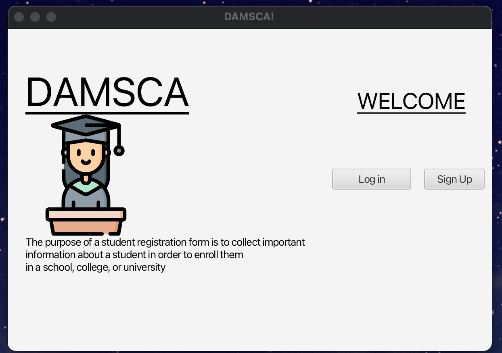
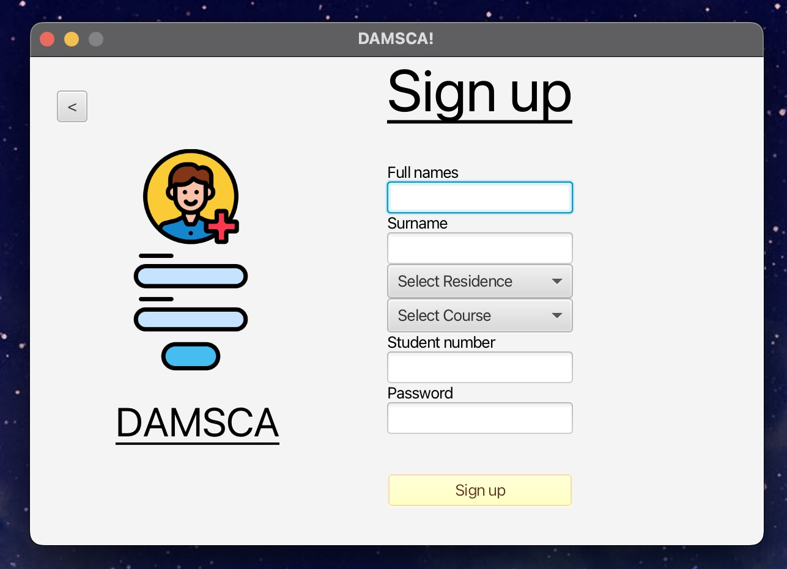
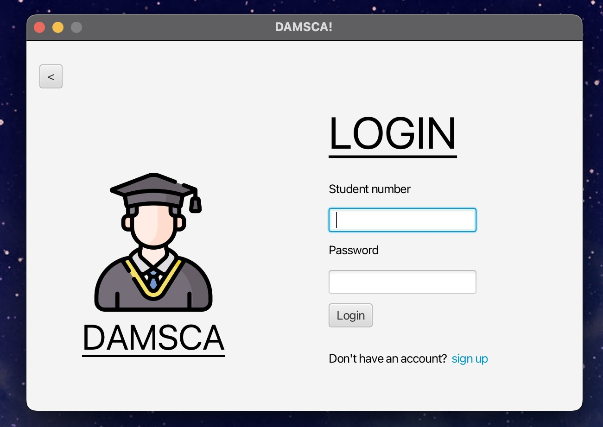
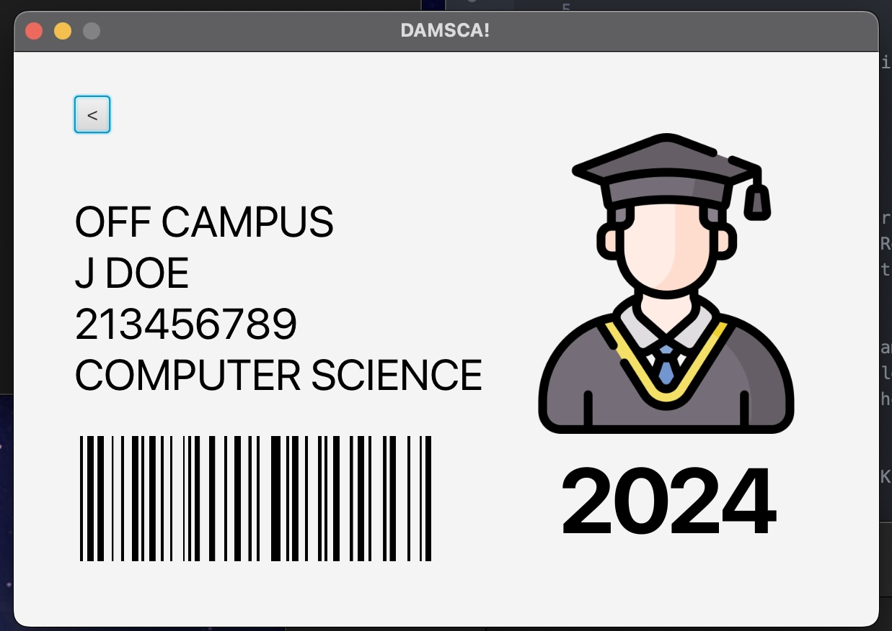
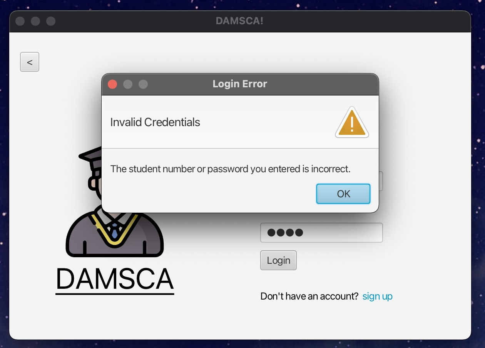

# Student Registration App

## Overview
The **Student Registration App** is a JavaFX-based application designed to manage student registrations. It provides functionalities such as user login, registration, profile management, and viewing student details.

## Features
- User Authentication (Login/Sign-up)
- Student Profile Creation
- Registration Management
- Viewing Student Profiles

- **FXML Views**: 
  - `login-view.fxml`: User login interface.
  - `register-view.fxml`: Registration interface.
  - `profile-view.fxml`: Student profile view.
  
## Technologies Used
- **Java**: The core programming language used.
- **JavaFX**: Used for building the graphical user interface.
- **FXML**: For defining the UI layout.
  
## Prerequisites
- Java Development Kit (JDK) 11 or higher
- JavaFX SDK

Student picture -> Student icons created by Freepik - Flaticon <br>
Student picture 2 -> University icons created by Freepik - Flaticon<br>
Sign up -> Sign up icons created by Flat Icons - Flaticon<br>
Student picture 3 -> University icons created by Freepik - Flaticon<br>
Bar code -> Mark PNGs by Vecteezy<br>


## How to Run
1. Clone the repository:
   ```bash
   git clone https://github.com/xMpR13/student-registration-app.git

### Screenshots

Welcome interface <br>
 <br>

Registration interface<br>
<br>

Login interface<br>
<br>

Student profile interface<br>
<br>

Error popup<br>
<br>
